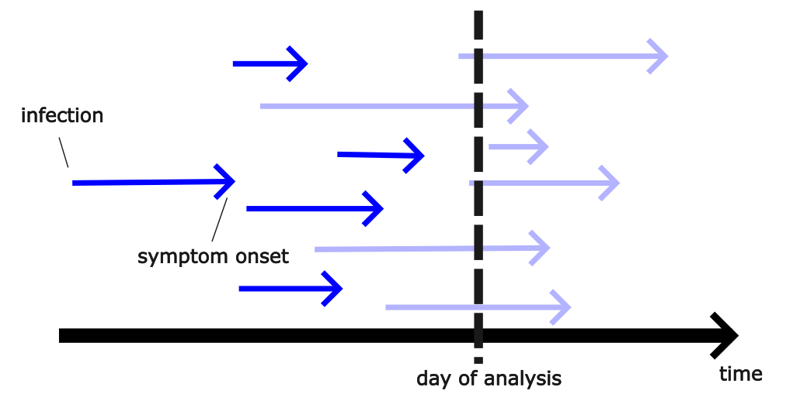
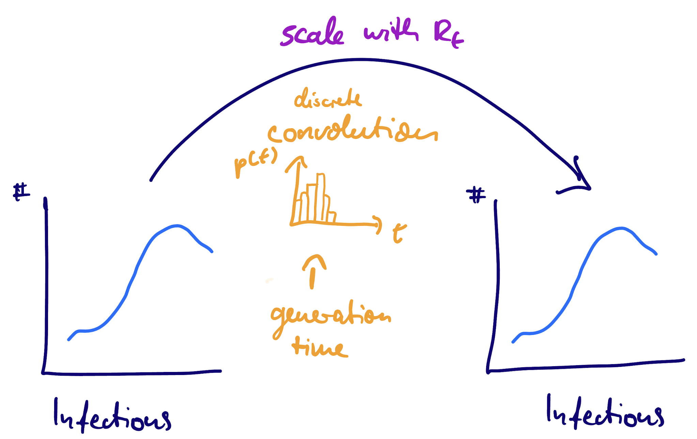
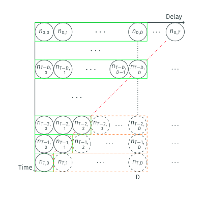
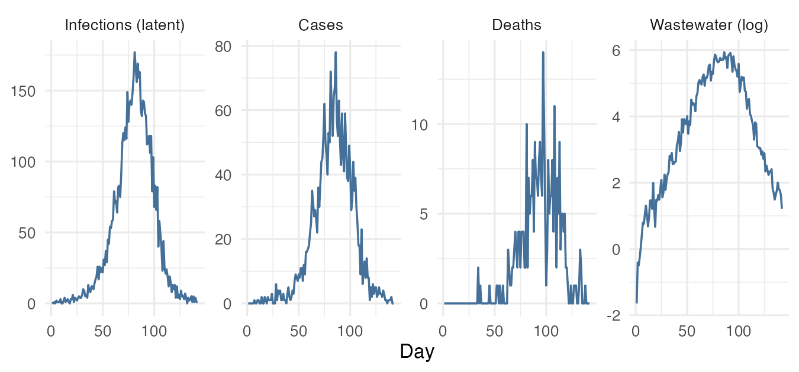
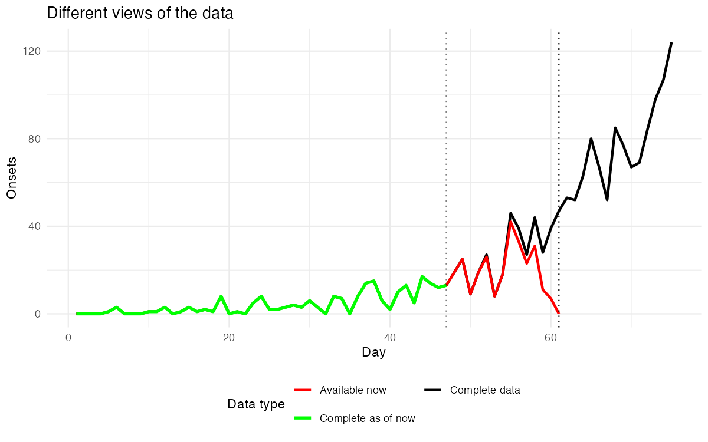

### Aim of this course:

How can we use data typically collected in an outbreak to answer questions like

- what **is** the number of cases now? (*nowcasting*)
- is it rising/falling and by how much? (*$R_t$ estimation*)
- what does this mean for the near future (*forecasting*, in the [companion course](https://nfidd.github.io/sismid-forecasting/))

in real time.

### Timeline

::: {.incremental}
- delay distributions and how to estimate them
- biases in delays: censoring and right truncation
- using delays to model the data generating process
- $R_t$ estimation and the renewal equation
- nowcasting, and joint estimation of delays and nowcasts
- linking nowcasting and forecasting
- modelling more complex reporting processes
- jointly fitting multiple surveillance data streams
:::

# Key takeaways

### Delay distributions {.smaller}

- delays play a fundamental role in nowcasting (and forecasting)
- we characterise them with probability distributions
- estimating delays requires correction for biases due to
  - **double interval censoring** (daily data)
  - **right truncation** (real-time analysis)

### $R_t$ estimation {.smaller}

- **$R_t$ estimation** using the renewal equation is a convolution problem
- improving the generative model leads to improvements in estimation (**geometric random walk** vs. independent priors)
- **generation time** is a key delay distribution for transmission dynamics
- understanding the role of the generative model in the estimation of $R_t$

### Nowcasting {.smaller}

- **nowcasting** is the task of predicting what data will look once delays have resolved
- it is a **right truncation problem** (same as discussed before)
- a **joint generative model** can combine delay estimation, nowcasting and $R_t$ estimation

### Complex reporting processes {.smaller}

- real reporting has structure beyond a single fixed delay: **day-of-week**, **time-varying**, **batched**, and by **strata**
- a **modular framework** (e.g. [`epinowcast`](https://package.epinowcast.org/)) generalises our joint model — each component is a swappable module
- the course model is the base; each extension is a one-line formula change

### Jointly fitting multiple data streams {.smaller}

- several surveillance streams are **delayed, scaled views** of the same infections
- a **shared latent infection process**, with a swappable observation model per stream
- together they constrain infections better than any one — but **conflict reveals model misspecification**

### Bridge: from nowcasting to forecasting {.smaller}

- nowcasts feed naturally into **forecasts** of the near future
- meaningful nowcasts and forecasts are **probabilistic**
- we can assess them using **proper scoring rules** (e.g. CRPS)
- the companion [forecasting course](https://nfidd.github.io/sismid-forecasting/) (second half of the week) covers forecasting models, evaluation, ensembles, and hubs

### Outlook {.smaller}

- the methods introduced here have **wide applications** in infectious disease epidemiology
- **open-source tools** ([`epinowcast`](https://package.epinowcast.org/), [`EpiNow2`](https://epiforecasts.io/EpiNow2/)) make this easier in practice

### Feedback {.smaller}

- please tell us if you enjoyed the course, what worked / didn't work etc.
- we will send out a survey for feedback

# Thank you for attending!

[Return to the session](../end-of-course-summary-and-discussion)
