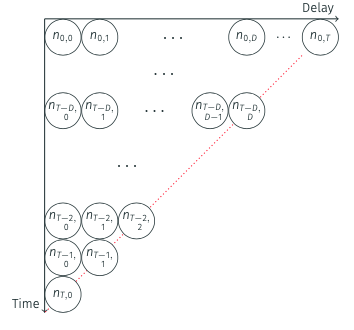

```{r setup, include = FALSE}
library("dplyr")
library("tidyr")
library("ggplot2")
set.seed(1)
days <- 0:41
ref_dow_effect <- c(1, 1, 1, 1, 0.95, 0.7, 0.7)
rep_dow_effect <- c(1, 1, 1, 1, 0.9, 0.4, 0.5)
base <- 100 * dnorm(days, mean = 20, sd = 9) /
  max(dnorm(days, mean = 20, sd = 9)) + 20
weekend_fill <- scale_fill_manual(
  values = c("FALSE" = "grey40", "TRUE" = "#c0392b"),
  labels = c("Weekday", "Weekend"), name = NULL
)
```

### The model we have so far {.smaller}

::::: {.columns}

:::: {.column width="60%"}

In the [joint nowcasting session](../joint-nowcasting) we modelled each cell of the reporting triangle as

$$
  n_{t,d} \mid \lambda_{t}, p_{t,d} \sim \text{Poisson}\left(\lambda_{t} \times p_{t,d}\right)
$$

- $\lambda_{t}$: expected onsets on day $t$ (a daily random walk)
- $p_{t,d}$: probability of an onset on day $t$ being reported with delay $d$
- a **single** delay distribution, the same on every day

Ideal for *learning*, and fine when the reporting process is simple.

::::

:::: {.column width="40%"}



::::

:::::

### Real reporting is messier {.smaller}

A single, fixed delay cannot capture:

- **Day-of-week effects** (fewer onsets or reports at weekends, or delays that differ by weekday)
- **Time-varying delays** (delays drift as a system gains or loses capacity)
- **Weekly / batched reporting** (data released weekly, not daily)
- **Strata** (delays differ by age, region, ...)
- **Missing reference dates**

```{r reports-dip, echo = FALSE, fig.width = 7, fig.height = 3.2}
tibble(day = days, reports = base * rep_dow_effect[(days %% 7) + 1]) |>
  ggplot(aes(day, reports, fill = (day %% 7) >= 5)) +
  geom_col() +
  weekend_fill +
  labs(x = "Report day", y = "Reports") +
  theme_minimal(base_size = 16) +
  theme(legend.position = "top")
```

### What is the downside in bespoke Stan? {.smaller}

To add a day-of-week effect *and* a time-varying delay by hand:

- Turn the delay vector into a matrix $p_{t,d}$, times a report-date factor $w_{(t+d)\bmod 7}$
- A random walk on the delay parameters (`meanlog[t]`, `sdlog[t]`) with priors
- Re-impose the per-date sum-to-one constraint every day
- More parameters, bigger `transformed parameters`, slower gradients, more to test

### `epinowcast`: one flexible tool {.smaller}

[`epinowcast`](https://package.epinowcast.org/) is a Bayesian framework for real-time surveillance.

- A direct generalisation of our joint model: triangle in, counts + reporting out
- Each component is a **module**, specified with an R **formula**
- *One* of several tools

::: {.callout-tip}
If you understand the joint nowcasting session, you already understand what `epinowcast` is doing, just with more flexible components.
:::

### The same model, as modules {.smaller}

```{=html}
<div style="display:flex;justify-content:center;margin-top:0.4em;">
<svg viewBox="0 0 880 330" width="100%" style="max-width:820px;font-family:inherit;" role="img" aria-label="Four epinowcast modules — expectation, reference date, report date and observation — combine into one nowcast.">
  <defs>
    <marker id="cr-arrow" viewBox="0 0 10 10" refX="8.5" refY="5" markerWidth="7" markerHeight="7" orient="auto-start-reverse">
      <path d="M0,0 L10,5 L0,10 z" fill="#5b6b7b"/>
    </marker>
  </defs>
  <g stroke="#5b6b7b" stroke-width="2" fill="none" marker-end="url(#cr-arrow)">
    <path d="M322,44 C450,44 520,150 600,161"/>
    <path d="M322,124 C440,124 500,158 600,164"/>
    <path d="M322,204 C440,204 500,170 600,168"/>
    <path d="M322,284 C450,284 520,180 600,171"/>
  </g>
  <g text-anchor="middle">
    <rect x="22" y="15" width="300" height="58" rx="9" fill="#eef2f7" stroke="#33506e" stroke-width="1.5"/>
    <text x="172" y="40" font-size="16" font-weight="600" fill="#1d2b3a">Expectation</text>
    <text x="172" y="61" font-size="13.5" font-family="monospace" fill="#41586e">enw_expectation()</text>
    <rect x="22" y="95" width="300" height="58" rx="9" fill="#eef2f7" stroke="#33506e" stroke-width="1.5"/>
    <text x="172" y="120" font-size="16" font-weight="600" fill="#1d2b3a">Reference date</text>
    <text x="172" y="141" font-size="13.5" font-family="monospace" fill="#41586e">enw_reference()</text>
    <rect x="22" y="175" width="300" height="58" rx="9" fill="#eef2f7" stroke="#33506e" stroke-width="1.5"/>
    <text x="172" y="200" font-size="16" font-weight="600" fill="#1d2b3a">Report date</text>
    <text x="172" y="221" font-size="13.5" font-family="monospace" fill="#41586e">enw_report()</text>
    <rect x="22" y="255" width="300" height="58" rx="9" fill="#eef2f7" stroke="#33506e" stroke-width="1.5"/>
    <text x="172" y="280" font-size="16" font-weight="600" fill="#1d2b3a">Observation</text>
    <text x="172" y="301" font-size="13.5" font-family="monospace" fill="#41586e">enw_obs()</text>
    <rect x="600" y="114" width="220" height="100" rx="10" fill="#2c7fb8" stroke="#1d5a86" stroke-width="1.5"/>
    <text x="710" y="158" font-size="19" font-weight="600" fill="#ffffff">Nowcast</text>
    <text x="710" y="182" font-size="13.5" fill="#dbeaf5">counts + reporting</text>
  </g>
</svg>
</div>
```

The **expectation**, **reference** and **observation** modules mirror what we built by hand; the **report date** module is new — it handles effects that act on the report date (e.g. day-of-week). Adding a feature is a one-line formula change.

### Mapping back to the bespoke model {.smaller}

| Bespoke model | `epinowcast` module |
|---|---|
| $\lambda_{t}$ random walk | `enw_expectation(~ rw(day))` |
| $p_{t,d}$ delay distribution | `enw_reference(~ 1)` |
| report-date effects | `enw_report(~ ...)` |
| Poisson likelihood | `enw_obs(family = "poisson")` |

The course model is just these modules; everything else is an extension of one of them.

### Day-of-week effects {.smaller}

A weekly pattern can enter in *three* distinct places:

- **Reference date, on the counts**: events truly happen at different rates by day of week
  → goes in the **expectation** module
- **Reference date, on the delay**: the delay distribution itself differs by the onset day of week
  → goes in the **reference** module
- **Report date**: the system processes reports at different rates by day of week
  → goes in the **report** module

```{r dow-effects, echo = FALSE, fig.width = 9, fig.height = 3}
sdlog <- 0.5
dows <- c("Mon", "Tue", "Wed", "Thu", "Fri", "Sat", "Sun")
# Longer delay for weekend onsets (a reference-date effect on the delay)
delay_meanlog_dow <- c(1, 1, 1, 1, 1, 1.4, 1.4)
tibble(
  dow = factor(dows, levels = dows),
  weekend = dows %in% c("Sat", "Sun"),
  `Onsets by weekday\n(expectation module)` = ref_dow_effect,
  `Mean delay by weekday\n(reference module)` =
    exp(delay_meanlog_dow + sdlog^2 / 2),
  `Reporting by weekday\n(report module)` = rep_dow_effect
) |>
  pivot_longer(
    -c(dow, weekend), names_to = "effect", values_to = "value"
  ) |>
  mutate(effect = factor(effect, levels = unique(effect))) |>
  ggplot(aes(dow, value, fill = weekend)) +
  geom_col() +
  facet_wrap(~effect, scales = "free_y") +
  weekend_fill +
  labs(x = "Day of week", y = NULL) +
  theme_minimal(base_size = 13) +
  theme(
    legend.position = "top",
    axis.text.x = element_text(angle = 45, hjust = 1)
  )
```

### Time-varying delay {.smaller}

Delays *may* lengthen under strain and shorten with spare capacity.

```{r tvd-drift, echo = FALSE, fig.width = 6.5, fig.height = 2.4}
sdlog <- 0.5
tibble(day = days) |>
  mutate(
    meanlog = 1 + 0.5 * day / max(days),
    mean_delay = exp(meanlog + sdlog^2 / 2),
    week = day %/% 7
  ) |>
  summarise(mean_delay = mean(mean_delay), .by = week) |>
  ggplot(aes(week, mean_delay)) +
  geom_line() +
  geom_point() +
  labs(x = "Reference week", y = "Mean delay (days)") +
  theme_minimal(base_size = 14)
```

```r
enw_reference(~ rw(week))   # delay drifts week to week
```

### Weekly (batched) reporting {.smaller}

Data are often *reported* weekly even though events happen daily.

```r
weekly <- enw_aggregate_cumulative(enw_long, timestep = "week")
enw_preprocess_data(weekly, max_delay = 3, timestep = "week")
```

- The reporting schedule is a property of the **data**, not the model
- The same expectation and delay modules apply, just on a weekly timestep

### Others, same idea {.smaller}

Each is a change to one formula, not a new model:

- **Strata** (age, region): `enw_reference(~ (1 | age_group))` — own delay per stratum, partial pooling across strata
- **Missing reference dates**: a dedicated `enw_missing()` module

::: {.callout-note}
`epinowcast` is one tool among several. Bespoke Stan models, `baselinenowcast` benchmarks, and other frameworks all have their place; the right choice depends on the problem.
:::

## `r fontawesome::fa("laptop-code", "white")` Your Turn {background-color="#447099" transition="fade-in"}

1. Reproduce the joint nowcasting model in `epinowcast`
2. Add day-of-week effects (on onsets, on the delay, and on reporting)
3. Let the delay vary over time
4. Fit weekly (batched) reporting with a reporting schedule

#

[Return to the session](../complex-reporting-processes)
