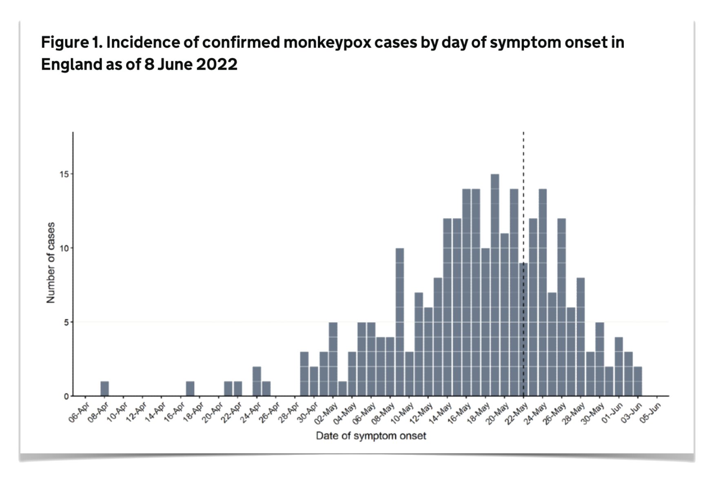

### "We were losing ourselves in details [...] all we needed to know is, are the number of cases rising, falling or levelling off?"

Hans Rosling, Liberia, 2014

. . .

- what **is** the number of cases now?
- is it rising/falling and by how much?
- what does this mean for the near future?

### Data usually looks like this


### Aggregated data can look like this {.smaller}



[UKHSA, 2022](https://www.gov.uk/government/publications/monkeypox-outbreak-technical-briefings/investigation-into-monkeypox-outbreak-in-england-technical-briefing-1) <br>
[Overton et al., *PLOS Comp Biol*, 2023](https://doi.org/10.1371/journal.pcbi.1011463)

### Aim of this course:

How can we use data typically collected in an outbreak to answer questions like

- what **is** the number of cases now? (*nowcasting*)
- is it rising/falling and by how much? (*$R_t$ estimation*)
- what does this mean for the near future (*forecasting*, covered in the [companion course](https://nfidd.github.io/sismid-forecasting/))

in real time.

### Approach

Throughout the course we will

1. use models to simulate data sets in **R** <br>
(the *generative model* of the simulated data)
   
```{r outbreak-plot, fig.width=5, fig.height=3, fig.align='center'}
library(ggplot2)
library(nfidd.nowcasting)
### visualise the infection curve
data(infection_times)
ggplot(infection_times, aes(x = infection_time)) +
  geom_histogram(binwidth = 1) +
  scale_x_continuous(n.breaks = 10) +
  labs(
    x = "Infection time (in days)", y = "Number of infections",
    title = "Infections during an outbreak"
  ) +
  theme_minimal()
```

### Approach

Throughout the course we will

2. apply generative models to simulated data in **Stan** to
   - learn about the system (conduct inference)
   - **make predictions** (nowcasting/forecasting)

### Approach

Throughout the course we will

3. build up to **nowcasting**: estimating what current counts will be once delayed reports arrive

### Approach

Throughout the course we will

4. finish by linking nowcasting and forecasting, bridging into the companion [forecasting course](https://nfidd.github.io/sismid-forecasting/)

### Timeline

This is the **nowcasting** course (first half of the week, Monday to Wednesday midday):

::: {.incremental}
- delay distributions and how to estimate them
- biases in delays: censoring and right truncation
- using delays to model the data generating process
- $R_t$ estimation and the renewal equation
- nowcasting, and joint estimation of delays and nowcasts
- linking nowcasting and forecasting (bridge to the forecasting course)
- modelling more complex reporting processes with `epinowcast`
- jointly fitting multiple surveillance data streams
:::

#

To start the course go to:
[https://nfidd.github.io/sismid-nowcasting/](https://nfidd.github.io/sismid-nowcasting/)
and get started on the first session (*Delay distributions*)

#

[Return to the session](../introduction-and-course-overview)
