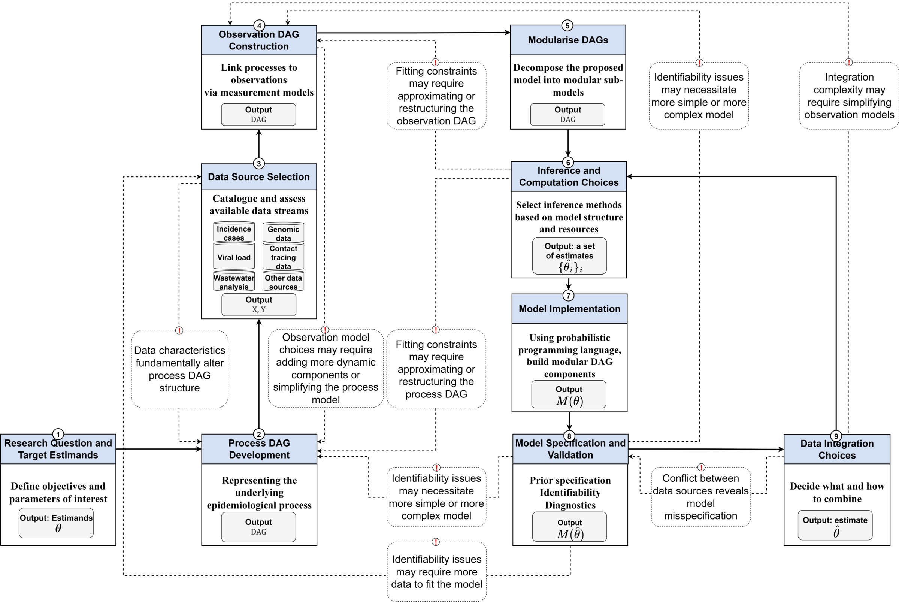

### One outbreak, several views

So far: estimate $R_t$ from a *single* observed time series.

In reality we watch an outbreak through *several* streams at once:

- **Cases** — timely, but depend on testing; only a fraction ascertained
- **Deaths** — stable, but long-delayed and severity-dependent
- **Wastewater** — does not depend on care-seeking, but indirect and on its own scale

Each is a delayed, scaled view of the *same* infections.

### The question

Our target is unchanged: recover the latent **infections** and **$R_t$**, as timely and as well-anchored as we can.

No single stream gives a clean view of both.

. . .

So the question is not just *"can we fit several streams?"* but:

> What does each stream add, and what happens when they pull in different directions?

### Don't reach for the whole model at once

Fitting several streams is one step in a wider **modelling workflow**: build, check, compare, revise.

We let that workflow drive how we develop the model.

### A workflow for infectious disease modelling



### The ideal model is modular

Reading the workflow from the bottom-left:

1. **Question & estimands** — infections and $R_t$
2. **Process model** — one shared renewal process
3. **Data source selection** — what each stream measures, and its biases
4. **Observation model per source** — a delay + a scaling + a likelihood
5. **Data integration** — *how* to combine them (the key choice)
6. **Inference, checking, revision** — conflict and identifiability feed back

. . .

A shared process, a swappable observation model per stream — so we can **build it in parts**.

### Parallel observation of shared infections

Every stream is its own convolution *of the shared latent infections*; conditionally independent given $I$.

$$
\text{cases}_t \sim f\big(\text{convolve}(I, p_\text{cases})\big), \quad
\text{deaths}_t \sim g\big(\text{convolve}(I, p_\text{deaths})\big)
$$

```{mermaid}
%%| fig-width: 9
flowchart TD
    R["Rt (geometric random walk)"] --> I["Shared latent infections I"]
    I -->|delay + ascertainment| C["Cases"]
    I -->|delay + IFR| D["Deaths"]
    I -->|delay + scaling| W["Wastewater"]
```

### Parallel, not sequential

**Parallel** (what we use): every stream looks *directly* at the shared infections $I$.

**Sequential**: chain one stream off another, e.g. $\text{deaths}_t \sim g(\text{convolve}(\text{cases}, p))$.

We keep infections as the *one* shared quantity that every stream informs.

### Build it in parts

One Stan model, three `use_*` switches — fit any subset of streams:

1. **Each stream on its own** — does it recover infections through its delay and scaling?
2. **Link two streams** — cases + deaths share one infection process
3. **Add the third** — wastewater too; infections and $R_t$ informed by all
4. **Stress-test** — what happens when streams *conflict*?

### What each stream buys you

- **Cases** pin down the *recent* trajectory (short delay)
- **Deaths** are uncertain near the present (long delay), but anchor the level
- Together they constrain infections better than either alone

. . .

But the *absolute level* stays weakly identified: streams constrain infections $\times$ scaling, not each separately. (The workflow's **identifiability** arrow.)

### When streams conflict

Each stream implies its own answer to *"what did infections look like?"*.

Streams **conflict** when those implied trajectories can't both come from one $R_t$ path:

- changing ascertainment (testing policy)
- mis-specified delays or scalings (e.g. drifting IFR)
- genuinely different populations

> *[Diagram placeholder: cases imply a falling epidemic while deaths imply a rising one; no single shared infection curve can satisfy both.]*

### Conflict distorts the joint fit

A single shared $I$ can't be both falling (cases, wastewater) and rising (deaths), so the model **splits the difference** — and $R_t$ is faithful to no stream.

It surfaces in three linked ways:

1. **Poor fit to one stream** (posterior predictive check)
2. **Tension in the shared infections** (distorted, more uncertain)
3. **Degraded sampling** (divergences, low ESS, high `rhat`)

### What to do about conflict

Conflict is *information*, not noise to average away.

- **Diagnose, don't average** — which stream, which assumption?
- **Relax the offending assumption** — e.g. time-varying ascertainment/IFR
- **Compare models** — does the conflict resolve?
- **Down-weight or drop** — last resort, only once you know *why*

This loop *is* the modelling workflow.

## `r fontawesome::fa("laptop-code", "white")` Your Turn {background-color="#447099" transition="fade-in"}

1. Simulate three parallel streams from one shared infection trajectory
2. Fit each stream alone, then link them through the shared infections
3. Recover infections and $R_t$ from the joint fit
4. Make the deaths conflict, and see how the joint model surfaces it

#

[Return to the session](../multiple-data-streams)
